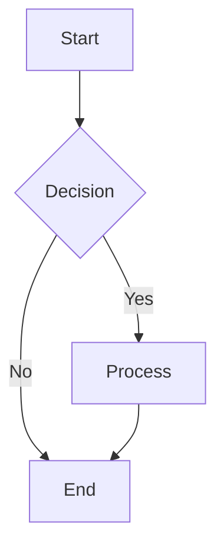
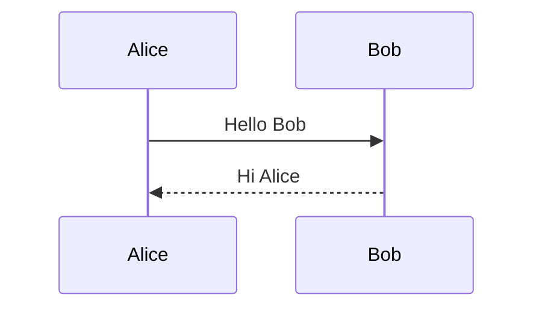
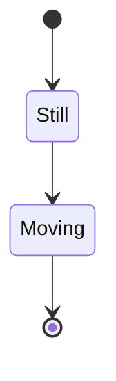

# Mermaid AST Design

This document describes the Abstract Syntax Tree (AST) structure for Mermaid diagram support in gDiagram.

## Overview

The Mermaid AST is designed to represent Mermaid diagrams in a format that can be easily converted to Graphviz DOT for rendering. The design focuses on the most commonly used Mermaid diagram types that map well to Graphviz rendering.

## Supported Diagram Types

### 1. Flowchart (Priority: HIGH)
Flowcharts are the most commonly used Mermaid diagram type and unique to Mermaid (not available in PlantUML).

**AST Classes:**
- `MermaidFlowchart` - Root diagram object
- `FlowchartNode` - Represents a node with shape and text
- `FlowchartEdge` - Represents connections between nodes
- `FlowchartSubgraph` - Nested groupings
- `FlowchartStyle` - CSS-style node styling

**Supported Features:**
- Directions: TD (top-down), LR (left-right), RL, BT
- Node shapes: rectangle, rounded, stadium, diamond, circle, hexagon, etc.
- Edge types: solid, dotted, thick
- Arrow types: normal, open, cross, none
- Subgraphs with titles
- Node styling via CSS classes

**Example Syntax:**

### 2. Sequence Diagram (Priority: MEDIUM)
Sequence diagrams show interactions between actors over time.

**AST Classes:**
- `MermaidSequenceDiagram` - Root diagram object
- `MermaidActor` - Participant or actor
- `MermaidMessage` - Message between actors
- `MermaidNote` - Annotations
- `MermaidLoop` - Control structures (loop, alt, opt, par, etc.)

**Supported Features:**
- Actors and participants
- Messages with various arrow types
- Activation/deactivation
- Notes (left of, right of, over)
- Loops and alternatives
- Autonumbering

**Example Syntax:**

### 3. State Diagram (Priority: MEDIUM)
State machines with transitions.

**AST Classes:**
- `MermaidStateDiagram` - Root diagram object
- `MermaidState` - Individual state
- `MermaidTransition` - Transition between states

**Supported Features:**
- Normal states
- Start/end states ([*])
- Transitions with labels
- State descriptions
- Notes

**Example Syntax:**

## Design Principles

### 1. Separation from PlantUML AST
While PlantUML and Mermaid share some diagram types (sequence, class, state), we maintain separate AST structures because:
- Syntax differences require different parsing
- Feature sets differ between the two
- Keeps the codebase modular and maintainable

### 2. Graphviz Compatibility
All AST structures are designed to be easily convertible to Graphviz DOT format:
- Node shapes map to Graphviz shapes
- Edge types map to Graphviz edge attributes
- Subgraphs map to Graphviz clusters

### 3. Error Handling
Each diagram type includes an `errors` collection for parse errors, allowing:
- Partial rendering of valid portions
- User feedback on syntax issues
- Progressive enhancement

### 4. Extensibility
The design allows for easy addition of:
- New diagram types (ER, Class, Gantt, etc.)
- New node shapes
- New styling options

## Future Diagram Types

### Class Diagram (Priority: LOW)
Can reuse rendering logic from PlantUML class diagrams with Mermaid-specific parsing.

### ER Diagram (Priority: LOW)
Entity-Relationship diagrams for database schemas.

### Gantt Chart (Priority: FUTURE)
Project timelines - requires different rendering approach (not easily mapped to Graphviz).

### Pie Chart (Priority: FUTURE)
Data visualization - requires different rendering approach.

## Implementation Status

- [x] AST structure defined
- [ ] Lexer implementation
- [ ] Parser implementation
- [ ] Renderer (DOT generation)
- [ ] UI integration
- [ ] Syntax highlighting

## References

- [Mermaid Official Documentation](https://mermaid.js.org/)
- [Mermaid Flowchart Syntax](https://mermaid.js.org/syntax/flowchart.html)
- [Mermaid Sequence Diagram Syntax](https://mermaid.js.org/syntax/sequenceDiagram.html)
- [Graphviz DOT Language](https://graphviz.org/doc/info/lang.html)
