# gDiagram Quick Start Guide

## Welcome to gDiagram!

The most comprehensive native diagram viewer for Linux, supporting **17+ diagram types** across PlantUML and Mermaid formats.

---

## 🚀 Getting Started in 60 Seconds

### 1. Launch gDiagram
```bash
gdiagram
```

### 2. Choose Your Format

**Mermaid** (Modern, concise syntax):


**PlantUML** (Rich UML features):


### 3. See Instant Preview
Type and watch your diagram appear in real-time!

---

## 📝 Quick Reference - Mermaid

### Flowchart (Most Popular)


**Shapes:**
- `[text]` - Rectangle
- `(text)` - Rounded
- `{text}` - Diamond
- `((text))` - Circle
- `([text])` - Stadium
- `[[text]]` - Subroutine

**Arrows:**
- `-->` - Solid
- `-.->` - Dotted
- `==>` - Thick

### Sequence Diagram


### State Diagram


### Class Diagram


### ER Diagram


### Gantt Chart


### Pie Chart


---

## 🎨 Styling (Mermaid Flowcharts)

### Individual Node Styling
```mermaid
style NodeId fill:#90EE90
style NodeId stroke:#228B22,stroke-width:2
```

### Reusable Style Classes
```mermaid
classDef myStyle fill:#90EE90,stroke:#228B22,stroke-width:2
class Node1,Node2,Node3 myStyle
```

### Available Properties
- `fill:#color` - Fill color
- `stroke:#color` - Border color
- `stroke-width:Npx` - Border thickness

---

## 🔗 Interactive Elements

### Clickable Nodes
```mermaid
click NodeId "https://example.com" "Tooltip text"
```

### Tooltips
```mermaid
click NodeId "" "Hover text here"
```

---

## ⌨️ Essential Keyboard Shortcuts

| Shortcut | Action |
|----------|--------|
| `Ctrl+N` | New tab |
| `Ctrl+O` | Open file |
| `Ctrl+S` | Save |
| `Ctrl+E` | Export |
| `Ctrl+F` | Find |
| `Ctrl+Plus/Minus` | Zoom |
| `Ctrl+Tab` | Next tab |

See [KEYBOARD_SHORTCUTS.md](KEYBOARD_SHORTCUTS.md) for complete list.

---

## 💡 Pro Tips

### 1. Use Templates
- Start with examples from `examples/` directory
- Copy and modify existing diagrams
- Use built-in templates (File → New from Template)

### 2. Color Code Your Diagrams
```mermaid
classDef success fill:#90EE90
classDef error fill:#FFB6C1
classDef warning fill:#FFD700
```

### 3. Organize with Subgraphs
```mermaid
subgraph Backend
    API[API Server]
    DB[(Database)]
end
```

### 4. Export for Sharing
- PNG for presentations
- SVG for documentation (vector, scales perfectly)
- PDF for printing

### 5. Use Multi-Tab Editing
- Work on multiple diagrams
- Compare different versions
- Quick tab switching

---

## 📚 Learning Path

### Beginner
1. Start with simple flowchart (5-10 nodes)
2. Add some styling
3. Try sequence diagram
4. Explore other types

### Intermediate
1. Use subgraphs for organization
2. Apply classDef for consistent styling
3. Add click actions and tooltips
4. Try all 7 Mermaid types

### Advanced
1. Complex workflows with multiple paths
2. Custom color themes
3. Combine multiple diagram types
4. Use validation for quality

---

## 🆘 Common Issues

### Diagram Not Rendering
- Check for syntax errors (red highlights)
- Verify opening/closing tags
- Look at error message details

### Wrong Colors
- Ensure hex colors start with #
- Use valid color names (red, blue, green)
- Check CSS color specifications

### Performance Slow
- Large diagrams (50+ nodes) may take longer
- Try different layout engine
- Consider splitting into smaller diagrams

### Export Issues
- Ensure file path is writable
- Check disk space
- Verify export format selected

---

## 📖 Further Reading

- **Examples**: See `examples/` directory for all diagram types
- **Full Docs**: Check `docs/MERMAID_EXAMPLES.md` for comprehensive guide
- **Features**: See `docs/SHOWCASE.md` for all features
- **Technical**: Read `docs/MERMAID_IMPLEMENTATION.md` for architecture

---

## 🎯 Your First Diagram

Try this complete example:

```mermaid
flowchart TD
    classDef successStyle fill:#90EE90,stroke:#228B22,stroke-width:2

    Start([🚀 Start]) --> Input{📝 Valid Input?}
    Input -->|Yes| Process[⚙️ Process]
    Input -->|No| Error[❌ Error]
    Process --> Success([✅ Success])
    Error --> End[🏁 End]
    Success --> End

    class Success successStyle
    style Error fill:#FFB6C1,stroke:#DC143C,stroke-width:2
    style Start fill:#87CEEB

    click Success "https://github.com/packerlschupfer/gDiagram"
```



This demonstrates:
- Different shapes
- Custom styling
- classDef
- Emojis
- Click actions
- Edge labels

---

**🌟 Welcome to gDiagram - Happy Diagramming!** 🎊
