# gDiagram - Comprehensive Diagram Gallery

Welcome to the complete showcase of gDiagram's capabilities!

## 🎯 What You'll Find Here

This gallery demonstrates **all 17+ diagram types** supported by gDiagram:
- ✅ 7 Mermaid diagram types with advanced features
- ✅ 10+ PlantUML diagram types with professional themes
- ✅ Real-world examples
- ✅ Best practices
- ✅ Styling techniques

---

## 📊 Mermaid Diagrams (7 Types)

### 1. Flowcharts - The Most Versatile

**Basic Flowchart:**

**Styled Flowchart:**

```mermaid
flowchart LR
    classDef success fill:#90EE90,stroke:#228B22,stroke-width:2
    classDef error fill:#FFB6C1,stroke:#DC143C,stroke-width:2

    Start([🚀 Begin]) --> Process[⚙️ Work]
    Process --> Done([✅ Complete])
    Process --> Failed([❌ Failed])

    class Done success
    class Failed error
```

**All Shapes Showcase:**

---

### 2. Sequence Diagrams - Interactions

**API Call Flow:**

---

### 3. State Diagrams - State Machines

**Order Processing:**

---

### 4. Class Diagrams - OOP Design

**E-Commerce System:**

---

### 5. ER Diagrams - Database Design

**Blog Platform:**

---

### 6. Gantt Charts - Project Planning

**Software Development Cycle:**

---

### 7. Pie Charts - Data Visualization

**Budget Allocation:**

---

## 📐 PlantUML Diagrams (10+ Types)

### Activity Diagrams - Process Flows

---

### Use Case Diagrams - System Actors

---

### Component Diagrams - Architecture

---

## 🎨 Styling Examples

### Color-Coded Flowchart

---

### Interactive Diagram with Links

```mermaid
flowchart TD
    Docs[📚 Documentation] --> Code[💻 Source Code]
    Code --> Build[🔨 Build]
    Build --> Deploy[🚀 Deploy]

    click Docs "https://github.com/packerlschupfer/gDiagram/tree/main/docs"
    click Code "https://github.com/packerlschupfer/gDiagram"
    click Build "https://github.com/packerlschupfer/gDiagram/actions"
    click Deploy "https://github.com/packerlschupfer/gDiagram/releases"
```

---

### Complex Workflow with Subgraphs

---

## 📚 Real-World Examples

### Software Architecture Diagram
Shows microservices architecture with databases and message queues

### Database Schema
Complete e-commerce database with users, products, orders, payments

### Project Timeline
Agile sprint planning with epics, stories, and milestones

### API Documentation
Sequence diagrams for all major API flows

### State Machine
Order lifecycle from creation to delivery

---

## 💡 Tips for Great Diagrams

### 1. Use Color Coding
- Green for success paths
- Red for error paths
- Blue for normal processing
- Yellow for decisions

### 2. Add Meaningful Labels
- Use descriptive node names
- Label decision branches clearly
- Add edge labels for context

### 3. Organize with Subgraphs
- Group related components
- Show system boundaries
- Improve visual hierarchy

### 4. Leverage Interactivity
- Add clickable links to documentation
- Include hover tooltips for details
- Link to related diagrams

### 5. Keep It Simple
- Limit to 20-30 nodes per diagram
- Split complex flows into multiple diagrams
- Use consistent naming conventions

---

## 🎯 Use Cases by Diagram Type

| Diagram Type | Best For |
|--------------|----------|
| **Flowchart** | Algorithms, processes, workflows |
| **Sequence** | API calls, user interactions, protocols |
| **State** | Order status, user states, lifecycles |
| **Class** | OOP design, software architecture |
| **ER** | Database schemas, data models |
| **Gantt** | Project planning, sprint schedules |
| **Pie** | Budget allocation, market share |

---

**All examples in this gallery can be copied and used as starting points for your own diagrams!**

**Try them in gDiagram**: `gdiagram examples/`
