# Mermaid Diagram Examples for gDiagram

This document contains working examples of Mermaid diagrams supported by gDiagram.

## Flowchart Examples

### Basic Flowchart

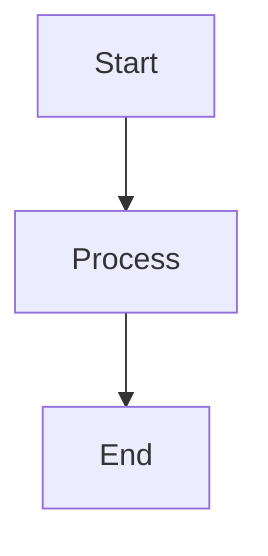

### Flowchart with Decision

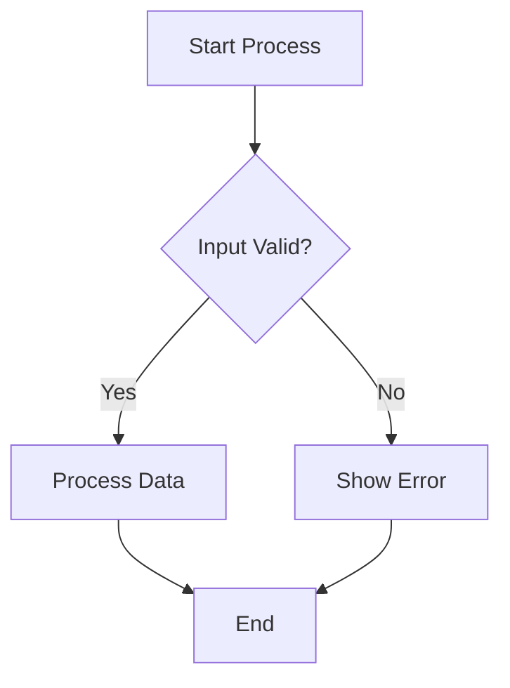

### All Node Shapes

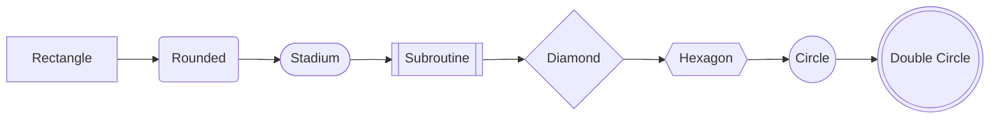

### Flowchart with Subgraph

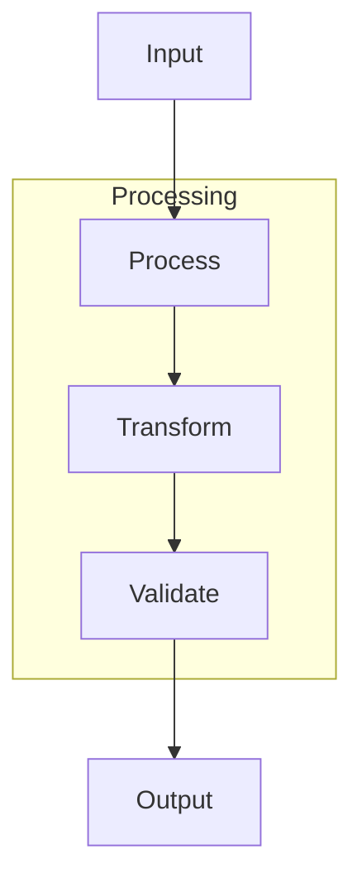

### Different Arrow Types

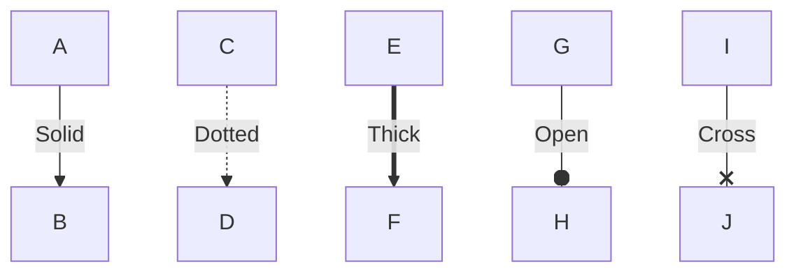

### Complex Workflow

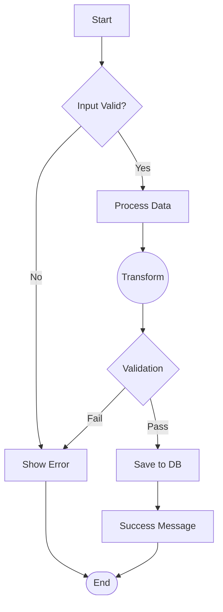

## Sequence Diagram Examples

### Basic Sequence

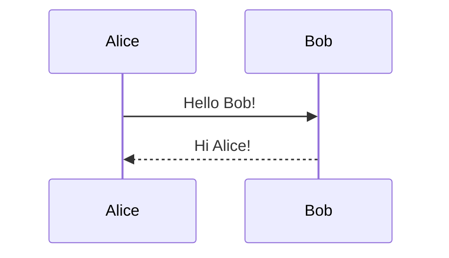

### With Participants

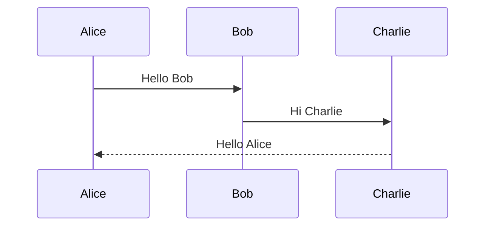

### With Aliases

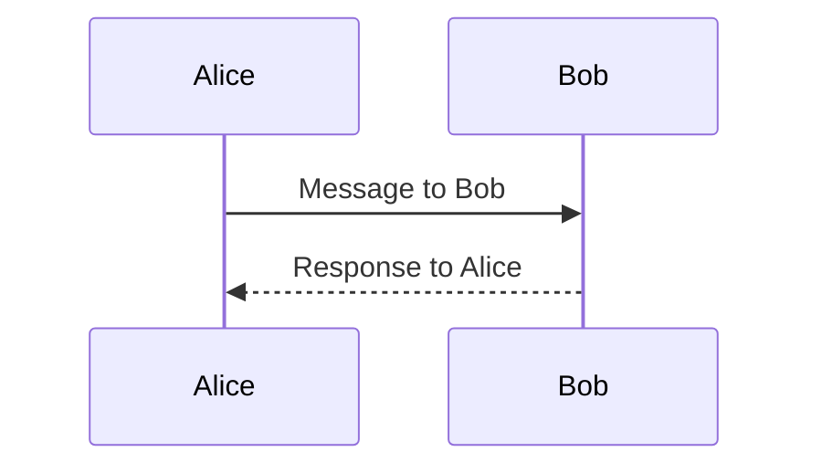

### With Autonumbering

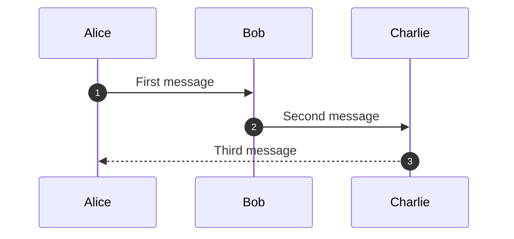

### With Notes

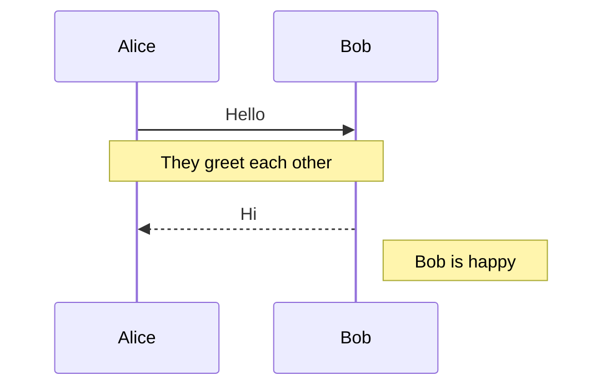

### With Activation/Deactivation

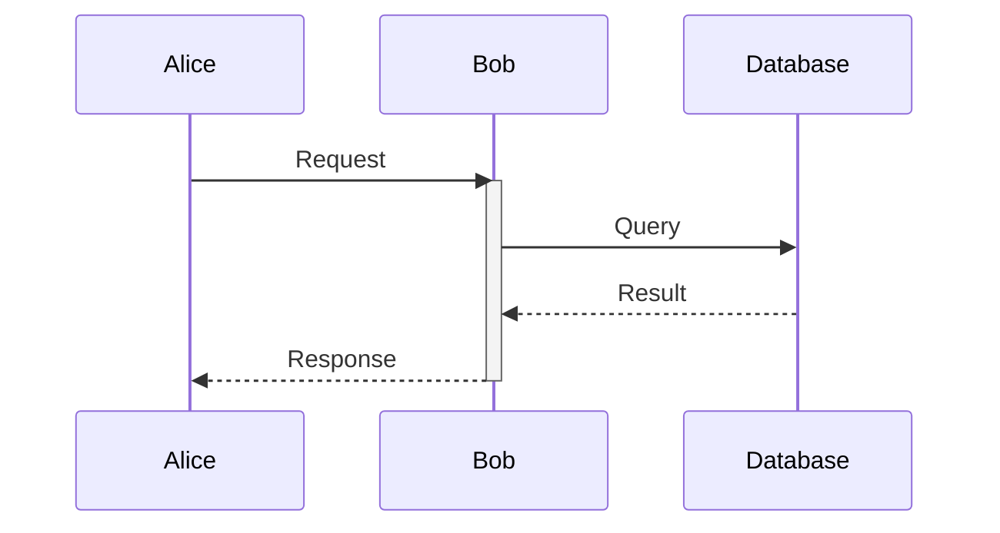

### With Loops and Alternatives

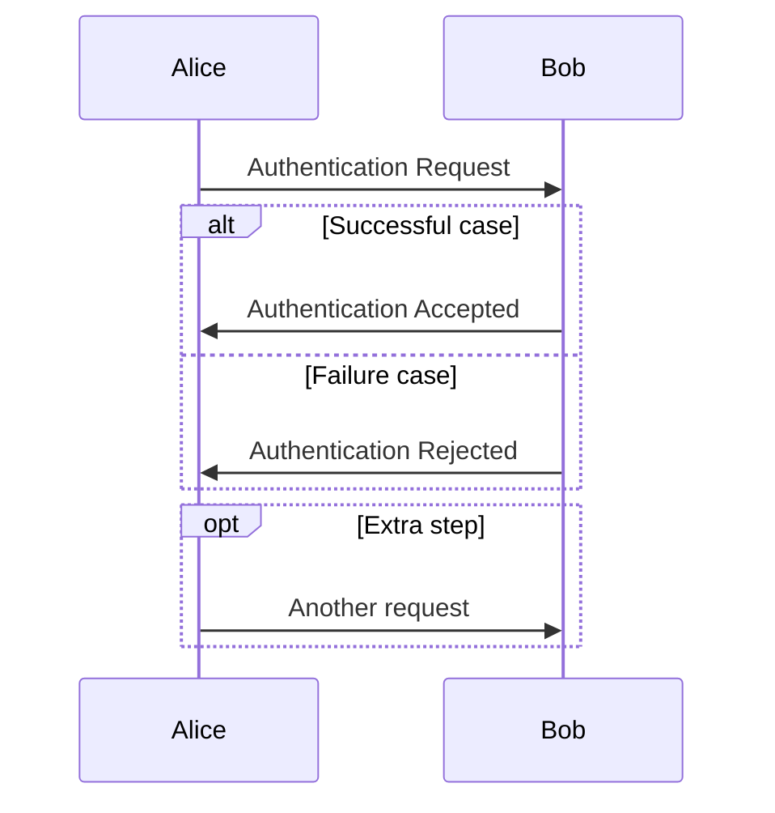

### Complete Authentication Flow

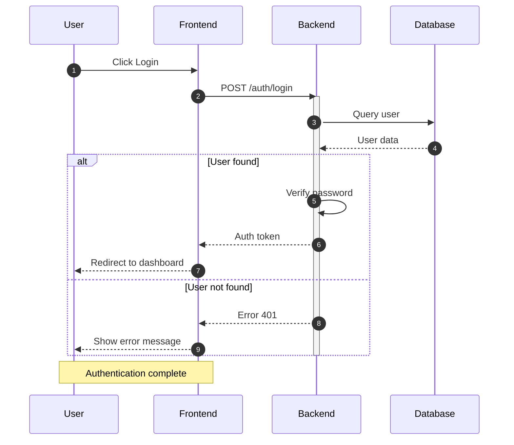

## State Diagram Examples

### Basic State Machine

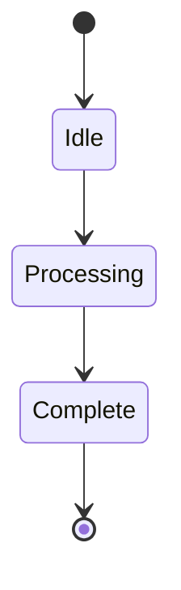

### State Machine with Labels

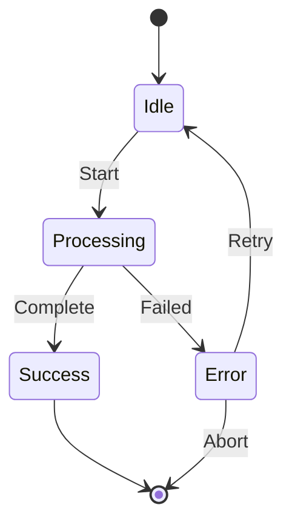

### State Machine with Descriptions

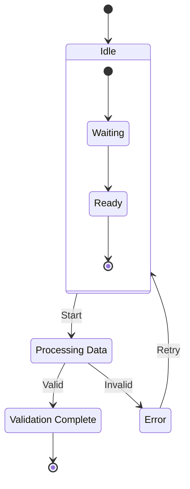

### Complex Workflow State Machine

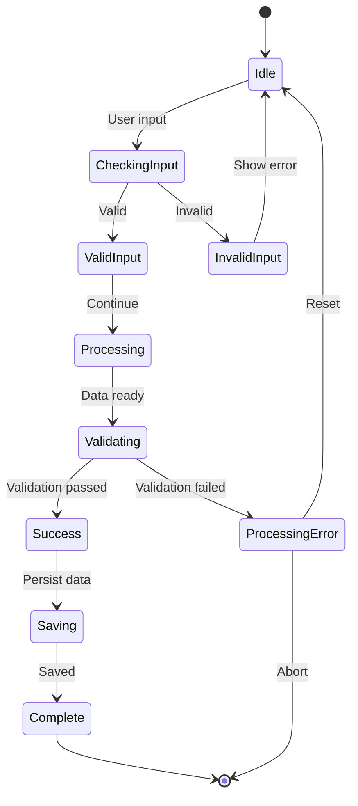

### State Machine with Choice and Fork

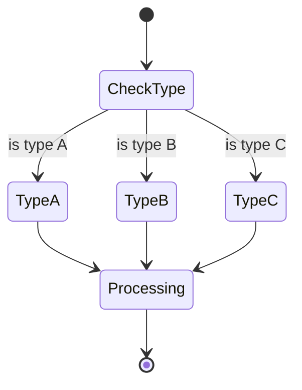

## ER Diagram Examples

### Basic ER Diagram

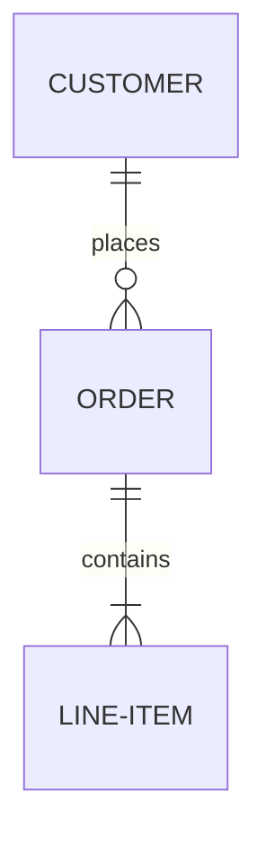

### ER Diagram with Attributes

```mermaid
erDiagram
    CUSTOMER ||--o{ ORDER : places
    ORDER ||--|{ LINE-ITEM : contains
    PRODUCT ||--o{ LINE-ITEM : "ordered in"

    CUSTOMER {
        string name
        string custNumber
        string sector
    }
    ORDER {
        int orderNumber
        string deliveryAddress
        date orderDate
    }
    LINE-ITEM {
        string productCode
        int quantity
        float pricePerUnit
    }
    PRODUCT {
        string code
        string description
        float price
    }
```

### Complete Database Schema

```mermaid
erDiagram
    CUSTOMER ||--o{ ORDER : "places"
    ORDER ||--|{ ORDER-ITEM : "contains"
    PRODUCT ||--o{ ORDER-ITEM : "includes"
    CATEGORY ||--o{ PRODUCT : "contains"
    SUPPLIER ||--o{ PRODUCT : "supplies"

    CUSTOMER {
        int customer_id PK
        string name
        string email
        string phone
    }

    ORDER {
        int order_id PK
        int customer_id FK
        date order_date
        decimal total_amount
    }

    PRODUCT {
        int product_id PK
        int category_id FK
        int supplier_id FK
        string name
        decimal price
        int stock_qty
    }

    CATEGORY {
        int category_id PK
        string name
        string description
    }

    SUPPLIER {
        int supplier_id PK
        string company_name
        string contact_name
        string phone
    }

    ORDER-ITEM {
        int order_item_id PK
        int order_id FK
        int product_id FK
        int quantity
        decimal unit_price
    }
```

## Supported Mermaid Features

### Flowchart

✅ **Supported:**
- Directions: TD (top-down), LR (left-right), RL (right-left), BT (bottom-top)
- Node shapes: Rectangle `[]`, Rounded `()`, Stadium `([])`, Subroutine `[[]]`, Diamond `{}`, Hexagon `{{}}`, Circle `(())`, Double Circle `((())))`
- Arrow types: `-->` (solid), `-.->` (dotted), `==>` (thick), `--o` (open), `--x` (cross)
- Edge labels: `A -->|Label| B`
- Chained edges: `A --> B --> C`
- Subgraphs with titles
- Style declarations (basic)

### Sequence Diagram

✅ **Supported:**
- Participants and actors
- Participant aliases: `participant A as Alice`
- Messages with arrows: `->>`, `-->>`, `->`, `-->`
- Arrow types: solid, dotted, open, cross
- Notes: `Note over A,B`, `Note right of A`, `Note left of A`
- Autonumbering
- Activation/deactivation
- Control structures: loop, alt, opt, par, critical, break, rect
- Title

### State Diagram

✅ **Supported:**
- State declarations: `state StateName`
- State descriptions: `state "Display Name" as StateName`
- Transitions: `State1 --> State2`
- Transition labels: `State1 --> State2: Event`
- Start state: `[*]`
- End state: `[*]`
- State types: normal, choice `<<choice>>`, fork `<<fork>>`, join `<<join>>`
- Nested/composite states
- State notes
- Title

### ER Diagram

✅ **Supported:**
- Entity declarations
- Entity attributes with types
- Cardinality notation:
  - `||` - Exactly one
  - `o|` - Zero or one
  - `|{` - One or more
  - `o{` - Zero or more
- Relationship labels
- Graphviz record shapes for entities
- Cardinality labels on edges

## File Format Support

gDiagram automatically detects the diagram format:

- **.puml, .plantuml, .pu** → PlantUML
- **.mmd, .mermaid** → Mermaid
- **Content detection** → Checks for `flowchart`, `sequenceDiagram`, or `@startuml` keywords

## Building Packages